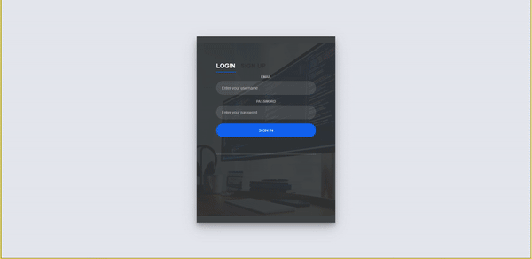

# Code Spaced
CodeSpaced will be a flashcard program for programmers that will use spaced repetition, a technique supported by cognitive science for fast and long-lasting memorization. This idea uses dynamic flashcards for programmers to have the option to ask themselves how to solve a specific challenge or write a specific method, testing whether they are using the correct syntax. The app will give the user the option to use a built-in code editor to create the front and back of the card. When the user decides to study that specific card, the user will have to match the syntax in the back of the card to be able to mark that card as learned. An algorithm will run in the back-end of the app to identify how often the user will need to practice that specific card.  The user will have a better chance to retain the syntax indefinitely in memory as well as develop muscle memory for the next time the user has to type the code.

<article>
      

  

<table>
  <tbody><tr>
    <td width="100%" valign="top">
      <h3><a id="user-content-portfolio" class="anchor" aria-hidden="true" href="#portfolio"><svg class="octicon octicon-link" viewBox="0 0 16 16" version="1.1" width="16" height="16" aria-hidden="true"><path fill-rule="evenodd" d="M7.775 3.275a.75.75 0 001.06 1.06l1.25-1.25a2 2 0 112.83 2.83l-2.5 2.5a2 2 0 01-2.83 0 .75.75 0 00-1.06 1.06 3.5 3.5 0 004.95 0l2.5-2.5a3.5 3.5 0 00-4.95-4.95l-1.25 1.25zm-4.69 9.64a2 2 0 010-2.83l2.5-2.5a2 2 0 012.83 0 .75.75 0 001.06-1.06 3.5 3.5 0 00-4.95 0l-2.5 2.5a3.5 3.5 0 004.95 4.95l1.25-1.25a.75.75 0 00-1.06-1.06l-1.25 1.25a2 2 0 01-2.83 0z"></path></svg></a>Demo</h3>
            
        
<strong>Node</strong> -> CRUD App

    </td>
  </tr>
</tbody></table>
</article>

## How To Use:
  - Fork the repo
  - Clone your forked repo.
  - Do 'npm install' in your terminal.
  - Run with 'npm start' in your terminal.
  - Log in with 'admin@admin.com'  password: 'admin'

